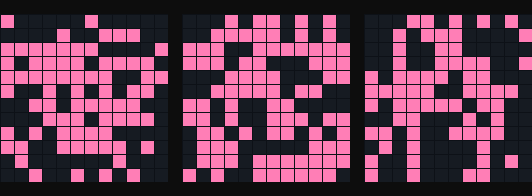

# Hopfield Dream Machine

A network of 144 artificial neurons stores three pixel-art memories (a heart, a smiley and a star). Scramble 30% of the pixels and watch the network "remember" the original, one neuron update at a time.

## Run it

    pip install numpy pillow
    python dream.py

## Play with it

- Raise the noise from 30% toward 50% and see where recall breaks
- Draw your own 12x12 patterns in `dream.py` (a `#` is on, a `.` is off)
- Add more patterns and find the capacity limit (about 0.14 x number of neurons)

## Neuroscience notes

Memories live in the weights. Hebbian learning ("neurons that fire together wire together") sets each weight, and recall is the network sliding downhill into the nearest stored pattern, an attractor. It is a classic toy model of associative memory (Hopfield, 1982).
